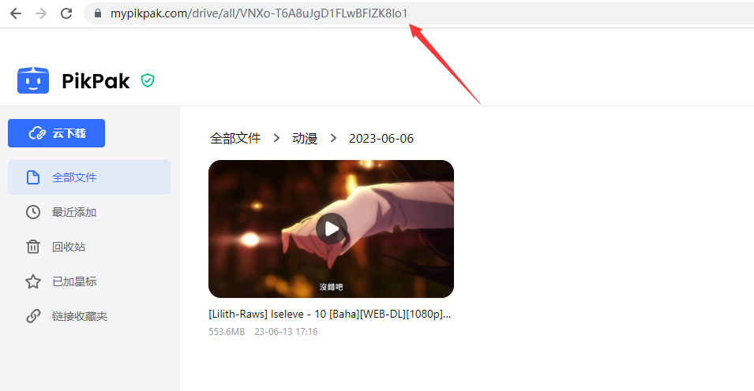

# 项目说明

<p align="center">
    
    <svg class="logo-svg" fill="none" xmlns="http://www.w3.org/2000/svg" data-v-d0d34286="" data-v-25779498=""><path opacity="0.985601" fill-rule="evenodd" clip-rule="evenodd" d="M33.4485 17.2408C32.9695 17.1802 32.5625 16.8616 32.3885 16.4112L30.9484 12.6823C30.8292 12.3737 31.0824 12.0495 31.4107 12.0903L46.5667 13.9768C47.3455 14.0737 48.0128 14.5803 48.3154 15.3045L50 19.3354L33.4485 17.2408Z" fill="var(--color-primary)" data-v-25779498=""></path><path opacity="0.985601" fill-rule="evenodd" clip-rule="evenodd" d="M26.5835 17.2408C27.0625 17.1802 27.4695 16.8616 27.6434 16.4112L29.0836 12.6823C29.2028 12.3737 28.9496 12.0495 28.6213 12.0903L13.4653 13.9768C12.6864 14.0737 12.0192 14.5803 11.7165 15.3045L10.032 19.3354L16.8876 18.4678L26.5835 17.2408Z" fill="var(--color-primary)" data-v-25779498=""></path><path fill-rule="evenodd" clip-rule="evenodd" d="M10 19.3359H50V41.3047C50 43.7754 47.9971 45.7784 45.5263 45.7784H14.4737C12.0029 45.7784 10 43.7754 10 41.3047V19.3359Z" fill="var(--color-primary)" data-v-25779498=""></path><path d="M25.5555 39.1113C25.5555 39.1113 27.755 40.0002 29.9793 40.0002C32.2036 40.0002 34.4444 39.1113 34.4444 39.1113" stroke="white" stroke-width="2.23683" stroke-linecap="round" data-v-25779498=""></path><path d="M22.889 27.9986V31.5541" stroke="white" stroke-width="3.57893" stroke-linecap="round" data-v-25779498=""></path><path d="M37.1111 27.9986V31.5541" stroke="white" stroke-width="3.57893" stroke-linecap="round" data-v-25779498=""></path></svg>
</p>
本项目是基于 [Mikan Project](https://mikanani.me)、[PikPak](https://mypikpak.com/) 的全自动追番整理下载工具。只需要在 [Mikan Project](https://mikanani.me) 上订阅番剧，就可以全自动追番。

## Bangumi-PikPak 功能说明

- 简易单次配置就能持续使用
- 无需介入的 `RSS` 解析器，解析番组信息并且自动生成下载规则。
- 根据番剧更新时间进行整理
- 无需维护完全无感使用
- 对于 Mikan RSS 的反代支持。

## 使用Alist将PikPak中的番剧列出

- 列出方法:https://alist.nn.ci/zh/guide/drivers/pikpak.html

## 开发中的功能

- 全自动重命名
- 根据番剧名称进行分类
- 指定番剧补番

## 配置教程

- 编辑Main.py中的:
  ```
  USER = ["用户名"]
  PASSWORD = ["密码"]
  PATH = ['文件夹ID']
  RSS = ["RSS链接"]
  ```

## 常见问题

### 文件夹ID:

可以通过 https://mypikpak.com/ 获取。



### RSS链接:

订阅番剧后，在「首页」分类的右下角，复制「RSS 订阅 」旁的图标内的链接。

蜜柑计划的 RSS 只记录了开始订阅番剧后更新的内容，并且 RSS 更新有些许延迟，请耐心等待。


请注意，RSS 订阅的链接格式应为：https://mikanani.me/RSS/MyBangumi?token=xxx%3d%3d 。
