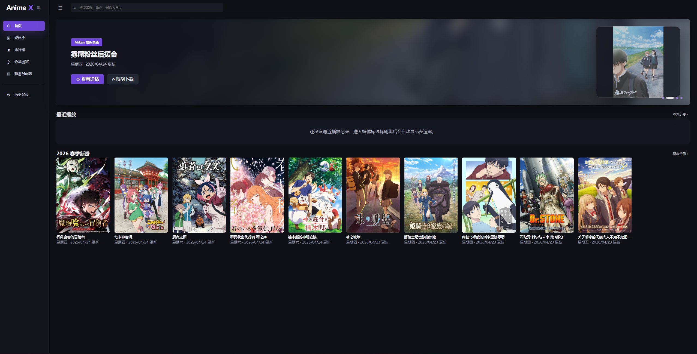
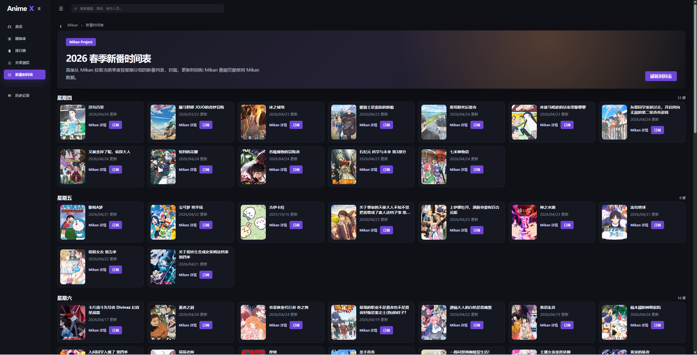
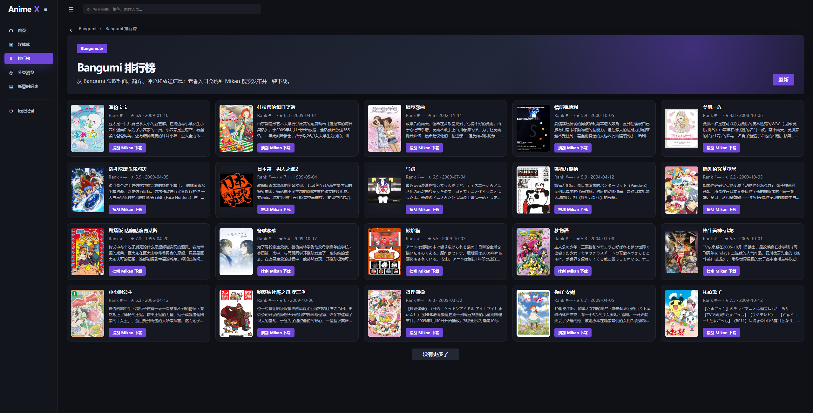
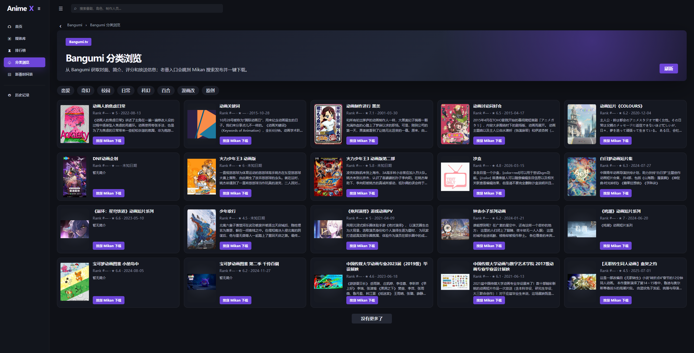

# Bangumi-PikPak

<p align="center">
    
    
    
</p>


Bangumi-PikPak 是基于 [Mikan Project](https://mikanani.me)、[Bangumi.tv](https://bangumi.tv/) 和 [PikPak](https://mypikpak.com/) 的自动追番整理下载工具。程序可以定时解析 Mikan RSS，也可以在 Web UI 中搜索番剧、搜刮 Mikan 发布并提交到 PikPak 离线下载，同时用 MySQL/Redis 做状态与缓存，降低重复请求和 PikPak 登录频控概率。

### 界面示例

#### 首页

<p align="center">
    
</p>

#### 新番时间表

<p align="center">
    
</p>

#### Bangumi 排行榜

<p align="center">
    
</p>

#### Bangumi 分类浏览

<p align="center">
    
</p>

## 功能特性

- 使用 `.env` 配置文件（仍兼容旧 JSON 配置）
- 默认启动内置 Vue Web UI，也支持纯命令行同步模式
- RSS 同步与 Web 服务分离：页面先启动，RSS 后台定时运行，互不阻塞
- 定时解析 Mikan RSS，自动访问 Mikan 条目页提取番剧标题
- 使用 MySQL 管理番剧、订阅、集数下载状态和媒体库元数据
- 媒体库快照写入 MySQL，默认 10 分钟内不重复拉取 PikPak，降低验证码/频控概率
- Redis 缓存 Mikan/Bangumi 外部数据，默认缓存 15 分钟
- 自动登录 PikPak
- 自动创建 PikPak 番剧文件夹
- 提交 PikPak 离线下载任务
- 尽量避免重复提交
- 支持 HTTP/HTTPS/SOCKS 代理环境变量
- 控制台日志与 `rss-pikpak.log` 轮转日志
- 内置 Vue Web UI：首页、媒体库、封面、详情页、选集播放、最近播放、历史记录、Bangumi 排行/分类、Mikan 新番时间表、Mikan 搜索和一键下载
- 首页 Banner 来自 Mikan 当前季度最近更新；“最近播放”来自浏览器 localStorage
- 前端已适配 PC 和手机端：PC 使用侧边栏，手机端使用底部导航
- 支持单次运行、持续运行、Web UI、Docker 和 systemd 部署

## 环境要求

- Go 1.22 或更高版本
- Node.js/npm（仅在需要重新构建前端时需要）
- 有效 PikPak 账号
- Mikan Project RSS 订阅链接
- 可选：MySQL 8.x 或兼容版本
- 可选：Redis 6.x 或兼容版本

Go 版使用 [`github.com/kanghengliu/pikpak-go`](https://pkg.go.dev/github.com/kanghengliu/pikpak-go) 访问 PikPak。

## 配置

复制示例配置：

```bash
cp .env.example .env
```

编辑 `.env`：

```env
USERNAME="your_email@example.com"
PASSWORD="your_password"
PATH="your_pikpak_folder_id"
RSS="https://mikanani.me/RSS/MyBangumi?token=your_token_here"
HTTP_PROXY="http://127.0.0.1:7890"
HTTPS_PROXY="http://127.0.0.1:7890"
SOCKS_PROXY="socks5://127.0.0.1:7890"
ENABLE_PROXY=false
MIKAN_USERNAME="your_mikan_email@example.com"
MIKAN_PASSWORD="your_mikan_password"
MYSQL_HOST="127.0.0.1"
MYSQL_PORT=3306
MYSQL_DATABASE="anime"
MYSQL_USERNAME="your_mysql_user"
MYSQL_PASSWORD="your_mysql_password"
MYSQL_DSN=
REDIS_ADDR="127.0.0.1:6379"
REDIS_PASSWORD=
REDIS_DB=0
```

配置项：

| 配置项 | 说明 |
|---|---|
| `USERNAME` | PikPak 账号邮箱 |
| `PASSWORD` | PikPak 账号密码 |
| `PATH` | PikPak 目标父文件夹 ID；程序会在这个目录下按番剧名创建分类文件夹 |
| `RSS` | Mikan RSS 订阅链接 |
| `HTTP_PROXY` | HTTP 代理地址 |
| `HTTPS_PROXY` | HTTPS 代理地址 |
| `SOCKS_PROXY` | SOCKS 代理地址 |
| `ENABLE_PROXY` | 是否启用代理 |
| `MIKAN_USERNAME` / `MIKAN_PASSWORD` | Mikanani 登录账号，用于 Web UI 一键订阅 |
| `MYSQL_*` | MySQL 连接信息；配置后程序会自动建表并使用 MySQL 管理状态 |
| `REDIS_ADDR` / `REDIS_PASSWORD` / `REDIS_DB` | Redis 缓存配置；配置后 Mikan/Bangumi 外部数据缓存 15 分钟 |

MySQL 表会在启动时自动创建，包括 `bangumi`、`episodes`、`subscriptions`、`cache_snapshots`。
Redis 连接失败不会阻止程序启动，只会退回实时拉取。

> `PATH` 这个字段是 PikPak 目录 ID，不是系统环境变量里的可执行文件搜索路径。程序只读取 `.env` 文件内容，不会覆盖系统 PATH。


## Go 版本运行

构建：

```bash
go build .
```

运行：

```bash
./bangumi-pikpak -config .env
```

Windows PowerShell：

```powershell
.\bangumi-pikpak.exe -config .env
```

单次运行，适合测试、cron 或容器任务：

```bash
go run . -config .env -once
```

## 常用参数

- `-config .env`：配置文件路径，默认 `.env`
- `-interval 600`：RSS 检查间隔，单位秒
- `-once`：只运行一次后退出
- `-web`：是否启动内置 Vue 前端页面，默认 `true`；如需纯后台同步可用 `-web=false`
- `-addr :8080`：Web UI 监听地址
- `-static frontend/dist`：Vue 前端构建产物目录
- `-log rss-pikpak.log`：日志文件路径
- `-state pikpak.json`：运行状态文件路径

## Web UI

前端现在是独立的 Vite + Vue 脚手架项目，源码位于：

```text
frontend/
```

首次运行或修改前端后先构建：

```powershell
cd frontend
npm install
npm run build
cd ..
```

默认启动前端挂载页面：

```powershell
go run . -config .env -addr 127.0.0.1:8080
```

打开 `http://127.0.0.1:8080` 后可以：

- 首页展示 Mikan 当前季度最近更新 Banner、本地最近播放、当前季度新番。
- 查看 PikPak 目标目录中的番剧分类、封面和集数。
- 选择集数在线播放，播放地址由后端临时获取 PikPak 下载/媒体链接。
- 媒体库默认是大屏封面墙；点击番剧封面后才进入选集播放页。
- 缺少封面时会按番剧名从 Bangumi.tv 搜索封面和简介，并写入 MySQL 元数据。
- 在线搜索 Mikan 发布，点击“下载到网盘”后按 `目标目录 / 番剧名 / 第xx集` 提交 PikPak 离线下载。
- 如果中文标题在 Mikan 精确搜索不到，后端会尝试 Bangumi 原名、别名和短关键词 fallback，例如 `海豹宝宝` 会尝试 `海豹`。
- 排行榜、分类浏览对接 Bangumi.tv；老番入口点击后会去 Mikan 搜索磁力/种子发布。
- 新番时间表直接从 Mikan 当前季度页面拉取，并按星期分组展示。
- 只有新番时间表提供订阅；排行榜/分类等老番入口会从 Mikan 搜索发布，拿到磁力/种子后再一键提交 PikPak。
- 历史记录和最近播放保存在当前浏览器 localStorage，不上传服务器。

### 页面结构

| 页面 | 数据来源 | 说明 |
|---|---|---|
| 首页 Banner | Mikan 当前季度 + Bangumi 封面补全 | 推荐最近更新的新番 |
| 最近播放 | 浏览器 localStorage | 播放或打开剧集后自动记录 |
| 媒体库 | PikPak 目录 + MySQL 快照 | 默认使用快照，手动刷新才重新扫描 PikPak |
| 详情页 | Bangumi/Mikan/PikPak 混合数据 | 展示封面、简介、剧集和搜刮下载入口 |
| 排行榜/分类浏览 | Bangumi.tv | 可跳转到 Mikan 搜索下载 |
| 新番时间表 | Mikan 当前季度页面 | 支持订阅新番 |
| 搜索结果 | Mikan 搜索 | 可提交到 PikPak 离线下载 |
| 历史记录 | 浏览器 localStorage | 只保存在当前浏览器 |

如果只想启动 Web UI、不自动周期 RSS 搜刮，可以加 `-once`：

```powershell
go run . -config .env -once -addr 127.0.0.1:8080
```

如果要恢复旧的纯命令行同步模式：

```powershell
go run . -config .env -web=false
```

## 缓存与 PikPak 验证码说明

PikPak 登录可能触发验证码或频控，例如：

```text
Error "captcha_invalid" (4002): Aborted - Your operation is too frequent, please try again later
```

程序不会自动识别或绕过验证码。为降低触发概率，当前策略是：

- 成功登录后，进程内会缓存登录状态一段时间。
- 媒体库扫描结果会写入 MySQL 快照，默认 10 分钟内不重复拉取 PikPak。
- Mikan/Bangumi 外部数据会写入 Redis，默认缓存 15 分钟。
- Web 启动后 RSS 同步延迟运行，避免页面加载和后台同步同时抢登录。
- 如果 PikPak 已经频控，建议先停止频繁刷新媒体库，等待一段时间后再手动刷新。

推荐日常使用方式：

1. 保持 MySQL 可用，让媒体库优先读快照。
2. Redis 可用时启用 Redis，减少 Mikan/Bangumi 重复请求。
3. 不需要重新扫描 PikPak 时，不要频繁点击“重新扫描 PikPak”。
4. RSS 周期不要设置过短，默认 `600` 秒即可。

## Docker

构建镜像：

```bash
docker build -t bangumi-pikpak-go .
```

运行容器：

```bash
docker run -d \
  --name bangumi-pikpak \
  -v /path/to/data:/app/data \
  bangumi-pikpak-go
```

确保 `/path/to/data/.env` 已存在。

## systemd

示例服务文件位于：

```text
docs/examples/bangumi-pikpak.service
```

典型部署路径：

```bash
sudo mkdir -p /opt/bangumi-pikpak
sudo cp bangumi-pikpak .env /opt/bangumi-pikpak/
sudo cp docs/examples/bangumi-pikpak.service /etc/systemd/system/
sudo systemctl daemon-reload
sudo systemctl enable --now bangumi-pikpak
```

## 工作流程

### RSS 自动同步

1. 读取 `.env`。
2. 应用代理配置。
3. 初始化 MySQL/Redis。
4. 启动 Web UI。
5. 后台定时拉取并解析 Mikan RSS。
6. 访问条目页面读取 `p.bangumi-title` 和封面信息。
7. 检查 MySQL 中的集数处理状态，避免重复下载。
8. 有新 torrent 时登录 PikPak。
9. 创建或复用 `PATH / 番剧名 / 第xx集` 文件夹。
10. 提交 PikPak 离线下载任务，并写入 MySQL 状态。

### Web 搜索下载

1. 前端输入关键词或从 Bangumi/Mikan 页面点击“搜刮下载”。
2. 后端调用 Mikan 搜索；没有结果时尝试 Bangumi 原名/别名/短关键词。
3. 用户选择合适发布，点击“下载到网盘”。
4. 后端解析番剧名、集数和封面简介。
5. 提交到 PikPak，并写入 MySQL，避免后续重复提交。

## 开发验证

```bash
go test ./...
go build .
```

`.env.example` 只包含示例值，不能用于真实下载。

## 许可证

MIT，详见 `LICENSE`。

