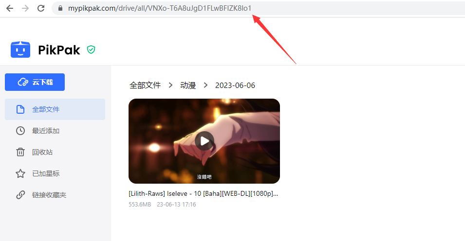
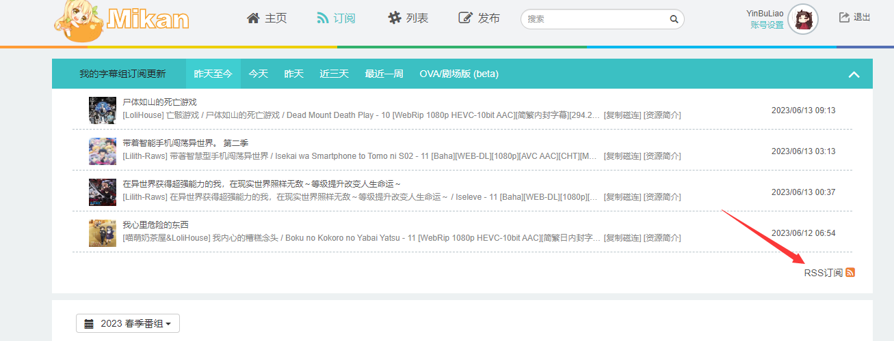

# AnimeX 

AnimeX 是一个基于 **Mikan Project + Bangumi.tv + 多储存桶后端** 的番剧整理、搜刮、下载和在线播放系统。

<p align="center">
    
    
    
</p>


---

## 界面预览

### 首页


### 新番时间表


### Bangumi 排行榜


### Bangumi 分类浏览


---

## 功能特性

### 自动追番与搜刮

- 从 Mikan Project 获取订阅 RSS。
- 定时解析 RSS 更新。
- 自动解析番剧标题、集数、种子和磁力链接。
- 支持 Mikan 搜索发布。
- 支持 Bangumi 排行榜、分类浏览、新番入口跳转到 Mikan 搜刮。
- 支持大合集和多层文件夹媒体扫描。
- 支持避免重复提交下载任务。

### 媒体库与播放

- 从储存桶扫描已有番剧资源。
- 支持按番剧、剧集、文件组织媒体库。
- 支持递归扫描合集目录。
- 支持 `.mp4 .mkv .avi .mov .flv .webm .m4v` 等常见视频格式。
- 优先从字幕组发布目录中提取干净番剧名。
- 根据番剧名到 Bangumi.tv 获取封面、简介、评分等信息。
- 统一 `/api/stream` 播放入口。
- 本地 / NAS 文件播放支持 HTTP Range。

### 多储存桶

当前支持以下储存桶类型：

| 类型 | 说明 |
|---|---|
| PikPak | 保留原有网盘离线下载和在线播放能力 |
| 115 网盘 | 使用 115 Cookie 和根目录 CID 对接 |
| 本地存储 | 使用 Aria2 JSON-RPC 下载到本地目录 |
| NAS 存储 | 将 NAS 视为已挂载本地路径，复用 Aria2 下载流程 |

### 用户系统

- 支持管理员和普通用户权限模型。
- 支持游客浏览开关。
- 支持注册开关。
- 支持邀请码注册开关。
- 管理员可批量生成、管理和删除邀请码。
- 普通用户可提交下载申请。
- 管理员审核通过后自动提交到当前储存桶。
- 后台可限制普通用户每日申请下载剧集数量。

### 管理员面板

管理员面板包含：

- 数据概览
- 用户管理
- 邀请码管理
- 番剧管理
- 下载申请
- 储存桶配置
- 日志管理
- 系统监控
- 系统设置
- 返回主页

### 代理与缓存

- 支持 HTTP / HTTPS / SOCKS 代理。
- MySQL 用于保存番剧索引、剧集状态、媒体库快照、订阅记录等业务数据。
- Redis 用于缓存 Mikan / Bangumi 外部请求结果。
- Redis 不可用时不会阻止程序启动。

---

## 环境要求

### 必需

- Go `1.25` 或更高版本
- Node.js `22` 或兼容版本
- npm

### 推荐

- MySQL 8.x 或兼容版本
- Redis 6.x 或兼容版本

### 按需启用

- PikPak 账号
- 115 Cookie
- Aria2 JSON-RPC
- 已挂载到本机的 NAS 路径

---

## 快速开始

### 1. 构建前端

```powershell
cd D:\Source\Bangumi-PikPak\frontend
npm install
npm run build
cd ..
```

### 2. 启动程序

```powershell
go run ./main.go
```

默认访问地址：

```text
http://127.0.0.1:8080
```

指定监听地址：

```powershell
go run ./main.go -addr 0.0.0.0:8080
```

### 3. 完成安装向导

首次打开页面后，系统会自动进入安装页面。

安装流程：

1. 填写 MySQL / Redis 连接信息。
2. 测试 MySQL / Redis 连接。
3. 创建管理员账号。
4. 自动写入数据库结构和安装状态。
5. 进入系统首页。

安装完成后会生成：

```text
data/animex.db
```

---

## 常用启动参数

| 参数 | 默认值 | 说明 |
|---|---:|---|
| `-configdb` | `data/animex.db` | 本地 SQLite 配置数据库路径 |
| `-interval` | `600` | RSS 后台同步间隔，单位秒 |
| `-once` | `false` | 只执行一次同步流程 |
| `-web` | `true` | 是否启动 Web UI |
| `-addr` | `:8080` | Web UI 监听地址 |
| `-static` | `frontend/dist` | 前端构建产物目录 |
| `-log` | 空 | 可选日志文件路径；默认只输出到控制台 |
| `-state` | 空 | 兼容旧版状态导入参数，仅用于迁移旧 PikPak 状态 |

示例：

```powershell
go run ./main.go -addr 0.0.0.0:8080 -interval 600
```

只运行一次同步流程：

```powershell
go run ./main.go -once
```

只跑后台同步，不启动 Web：

```powershell
go run ./main.go -web=false
```

---

## 获取配置信息

### 获取 PikPak 文件夹 ID

1. 登录 [PikPak](https://mypikpak.com/)。
2. 打开或创建一个用于保存番剧的目录。
3. 从浏览器地址栏复制最后一段目录 ID。

示例：

```text
https://mypikpak.com/drive/all/VNXo-T6A8uJgD1FLwBFIZK8lo1
```

其中：

```text
VNXo-T6A8uJgD1FLwBFIZK8lo1
```

就是目录 ID。



### 获取 Mikan RSS 链接

1. 登录 [Mikan Project](https://mikanani.me/)。
2. 订阅你需要追番的番剧。
3. 在 Mikan 首页右下角找到 `RSS 订阅`。
4. 复制 RSS 图标对应的链接。



RSS 链接格式通常类似：

```text
https://mikanani.me/RSS/MyBangumi?token=xxx%3d%3d
```

注意：Mikan RSS 只会记录你开始订阅以后更新的内容，历史发布不一定会出现在 RSS 中；如果需要补番，请使用系统内的 Mikan 搜索 / Bangumi 搜刮入口。

---

## 储存桶配置

后台进入：

```text
管理员面板 -> 储存桶配置
```

### PikPak

需要配置：

- PikPak 账号 / 密码，或 Access Token / Refresh Token
- PikPak 目标目录 ID

下载目录结构：

```text
PikPak 目标目录/
├── 番剧名/
│   ├── 第01集/
│   ├── 第02集/
│   └── 第03集/
```

### 115 网盘

需要配置：

- 115 Cookie
- 115 根目录 CID

当前版本采用 Cookie 配置方式，不包含扫码登录。

### 本地存储

需要配置：

- Aria2 RPC 地址
- Aria2 RPC Secret
- 本地保存路径

示例：

```text
D:\AnimeX
```

### NAS 存储

NAS 第一版按“已经挂载到本机路径”处理。

需要配置：

- Aria2 RPC 地址
- Aria2 RPC Secret
- NAS 挂载路径

示例：

```text
Z:\AnimeX
/mnt/nas/anime
```

---

## Docker 部署

### 已发布镜像

镜像已经发布到 Docker Hub：

```text
docker.io/yinbuliao/bangumi-pikpak
```

可用标签：

| 标签 | 说明 |
|---|---|
| `latest` | 最新稳定构建 |
| `20260425` | 2026-04-25 构建快照 |

拉取镜像：

```bash
docker pull yinbuliao/bangumi-pikpak:latest
```

**首次启动会随机生成 MySQL 密码，并输出到终端，同时保存到：**

```text
docker-data/secrets/mysql_password.txt
docker-data/secrets/mysql_root_password.txt
docker-data/secrets/admin_password.txt
```

### 单容器运行

```bash
docker run -d \
  --name animex \
  -p 8080:8080 \
  -v /path/to/animex-data:/app/data \
  -e ANIMEX_MYSQL_HOST=你的MySQL地址 \
  -e ANIMEX_MYSQL_PORT=3306 \
  -e ANIMEX_MYSQL_DATABASE=animex \
  -e ANIMEX_MYSQL_USERNAME=animex \
  -e ANIMEX_MYSQL_PASSWORD=你的MySQL密码 \
  -e ANIMEX_REDIS_ADDR=你的Redis地址:6379 \
  --restart unless-stopped \
  yinbuliao/bangumi-pikpak:latest
```

访问：

```text
http://服务器IP:8080
```

本地配置数据库会保存在宿主机：

```text
/path/to/animex-data/animex.db
```

> 单容器模式只包含 AnimeX 程序本体，不包含 MySQL 和 Redis。  
> 如果你不想单独准备数据库，推荐使用下面的一体化部署。

## 工作流程

### RSS 自动同步

1. 程序启动 Web 服务。
2. 从 `data/animex.db` 读取后台配置。
3. 初始化 MySQL / Redis。
4. 按配置周期拉取 Mikan RSS。
5. 解析番剧标题、集数、种子或磁力链接。
6. 检查 MySQL 中是否已经存在对应剧集。
7. 根据当前储存桶创建目录。
8. 提交下载任务到 PikPak / 115 / Aria2。
9. 写入剧集状态和媒体库快照。

### Web 搜刮下载

1. 用户从首页、排行榜、分类浏览、新番时间表或搜索框进入番剧。
2. 系统根据 Bangumi / Mikan 数据搜索发布。
3. 管理员可以直接提交下载。
4. 普通用户提交下载申请。
5. 管理员审核通过后自动提交到储存桶。
6. 下载结果会更新为已下载或下载失败。

---

## 开发命令

后端检查：

```bash
go test ./...
go build .
```

前端构建：

```bash
cd frontend
npm install
npm run build
```

完整检查：

```bash
go test ./...
cd frontend
npm run build
```

---

## 常见问题

### Q: 提示“文件夹不存在”或无法创建 PikPak 目录怎么办？

检查后台储存桶配置里的 PikPak 目录 ID 是否正确。目录 ID 不是目录名称，而是 PikPak 网页地址栏里的最后一段 ID。

参考上面的“获取 PikPak 文件夹 ID”。

### Q: Mikan RSS 链接在哪里获取？

登录 Mikan Project 后，订阅番剧，在首页右下角复制 `RSS 订阅` 图标对应的链接。

RSS 链接通常类似：

```text
https://mikanani.me/RSS/MyBangumi?token=xxx%3d%3d
```

### Q: RSS 没有立刻出现我刚订阅的番剧？

Mikan RSS 本身有延迟，并且 RSS 通常只记录你开始订阅以后更新的内容。如果你要下载历史剧集或补番，请使用系统内的 Mikan 搜索、Bangumi 排行榜或分类浏览入口搜刮下载。

### Q: 为什么没有自动下载历史集数？

RSS 更适合追新番更新，不适合补全历史全集。历史资源建议通过搜索页面或 Bangumi 搜刮入口手动提交，或者由普通用户提交申请、管理员审核下载。

### Q: 代理连接失败怎么办？

检查：

1. 代理地址和端口是否正确。
2. 代理服务是否正在运行。
3. 后台是否启用了代理开关。
4. 容器部署时，容器是否能访问宿主机代理地址。

### Q: 种子或磁力被重复添加怎么办？

系统会通过 MySQL 记录番剧和剧集状态，尽量避免重复提交。如果仍然出现重复，请检查：

- 番剧标题是否被不同字幕组写成多个名称。
- 剧集号是否能被正确解析。
- 是否手动修改过媒体库目录结构。
- 是否清空过 MySQL 状态表。

### Q: 媒体库扫描不到已经存在的资源？

请确认：

1. 当前后台选择的储存桶类型正确。
2. PikPak / 115 / 本地 / NAS 的根目录配置正确。
3. 视频文件后缀在支持范围内。
4. 合集资源是否在多层子目录中；当前版本会递归扫描，但目录名过于混乱时可能需要重新扫描或手动调整目录。
5. MySQL 是否正常连接，因为媒体库快照和番剧索引依赖 MySQL。

### Q: 为什么本地 / NAS 点击播放没有画面？

请检查：

- 视频文件是否真实存在。
- 程序进程是否有读取该路径的权限。
- Docker 部署时是否把本地 / NAS 路径挂载进容器。
- 浏览器是否支持当前视频编码。部分 `.mkv`、HEVC、10bit 视频浏览器可能无法直接播放。

### Q: PikPak 登录提示验证码、频率过高或 captcha_invalid 怎么办？

PikPak 可能会对频繁登录或请求触发风控。建议：

1. 不要频繁刷新媒体库。
2. 启用 MySQL，让媒体库优先读快照。
3. 启用 Redis，减少 Mikan / Bangumi 重复请求。
4. 使用 Access Token / Refresh Token 配置，减少账号密码登录次数。
5. 等待一段时间后再重试。

### Q: `go run ./main.go` 启动后看起来没有输出，是不是卡住了？

默认日志主要输出到控制台，Web 服务会监听 `:8080`。请直接打开：

```text
http://127.0.0.1:8080
```

如果端口被占用，可以换端口：

```powershell
go run ./main.go -addr 127.0.0.1:8081
```

### Q: Docker 里使用 Aria2、本地存储或 NAS 需要注意什么？

如果 Aria2 在宿主机上，容器里的 `127.0.0.1` 指的是容器自己，不是宿主机。你需要把 Aria2 RPC 地址配置成容器可访问的地址。

同时，本地存储 / NAS 路径必须通过 `-v` 挂载进容器，否则容器内无法读取或写入。

---

## 致谢

- [Mikan Project](https://mikanani.me/)：提供番剧 RSS 与发布信息。
- [Bangumi.tv](https://bangumi.tv/)：提供番剧元数据、封面、评分和分类数据。
- [PikPak](https://mypikpak.com/)：提供云存储和离线下载能力。
- [Aria2](https://aria2.github.io/)：提供本地 / NAS 下载能力。

---

## License

MIT，详见 [LICENSE](LICENSE)。

如果这个项目对你有帮助，欢迎给一个 Star。
