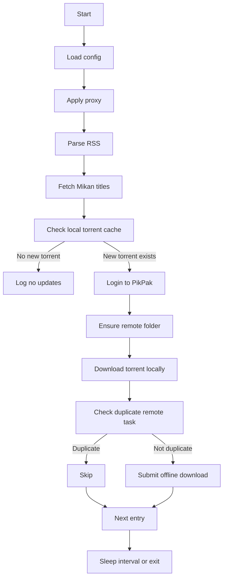

# Go Migration Design

Date: 2026-04-24
Project: Bangumi-PikPak

## Outcome

Convert the current Python single-file Bangumi-PikPak application into a Go application while preserving the current user-facing behavior and adding a cleaner production-oriented structure.

The Go version will keep the same core workflow:

1. Load `config.json`.
2. Configure optional HTTP/HTTPS/SOCKS proxy behavior.
3. Poll the configured Mikan RSS feed.
4. Visit each Mikan entry page and extract the Bangumi title.
5. Sanitize the Bangumi title for local and remote folder use.
6. Check whether the torrent file already exists locally.
7. If new torrents exist, login to PikPak.
8. Ensure a matching PikPak folder exists under the configured parent folder.
9. Download the torrent locally.
10. Submit the torrent URL to PikPak offline download.
11. Avoid duplicate remote offline tasks where practical.
12. Persist runtime state and write rotating logs.
13. Repeat on a configured interval unless running in one-shot mode.

## Current Python Baseline

The current implementation is centered in `main.py` and depends on:

- `feedparser` for RSS parsing.
- `BeautifulSoup` for Mikan HTML parsing.
- `PikPakAPI` for PikPak login, file listing, folder creation, token refresh, and offline download.
- `httpx` and `urllib` for HTTP requests.
- `pathvalidate` for filename sanitization.
- Python logging with `RotatingFileHandler`.

Important persisted files:

- `config.json`: user configuration.
- `pikpak.json`: Python client token/state file.
- `rss-pikpak.log`: rotating log output.
- `torrent/<bangumi-title>/<torrent-name>`: local torrent cache.

## Selected Approach

Use a Go rewrite with modular internal packages and `github.com/kanghengliu/pikpak-go` as the PikPak API client instead of manually implementing PikPak HTTP endpoints.

This reduces risk because the project does not need to reverse-engineer PikPak auth and request signing in the first Go migration. The application will own orchestration, configuration, logging, RSS parsing, Mikan title extraction, local cache behavior, duplicate checks, and deployment ergonomics.

## Package Layout

```text
cmd/bangumi-pikpak/
  main.go

internal/app/
  app.go
  runner.go

internal/config/
  config.go

internal/logger/
  logger.go

internal/rss/
  rss.go

internal/mikan/
  mikan.go

internal/pikpak/
  client.go
  state.go

internal/torrent/
  torrent.go

internal/sanitize/
  sanitize.go

internal/proxy/
  proxy.go

docs/examples/
  bangumi-pikpak.service

Dockerfile
go.mod
README.md
```

### `cmd/bangumi-pikpak/main.go`

Responsibilities:

- Parse CLI flags.
- Resolve the config path.
- Initialize logger.
- Load config.
- Apply proxy environment variables and HTTP transport options.
- Create the app runner.
- Handle `SIGINT` and `SIGTERM`.
- Run once or run forever on an interval.

Planned flags:

- `-config`: path to config file, default `config.json` next to the executable or working directory.
- `-interval`: RSS polling interval in seconds. Default comes from config or 600 seconds.
- `-once`: run one sync cycle and exit.
- `-log`: log file path, default `rss-pikpak.log`.

### `internal/config`

Responsibilities:

- Define a `Config` struct compatible with the existing `example.config.json`.
- Load JSON config.
- Write JSON config back in stable, pretty-printed form.
- Validate required fields.

Compatibility fields:

```json
{
  "username": "your_email@example.com",
  "password": "your_password",
  "path": "your_pikpak_folder_id",
  "rss": "https://mikanani.me/RSS/MyBangumi?token=your_token_here",
  "http_proxy": "http://127.0.0.1:7890",
  "https_proxy": "http://127.0.0.1:7890",
  "socks_proxy": "socks5://127.0.0.1:7890",
  "enable_proxy": false
}
```

Optional Go-specific fields may be added later, but the initial migration should not require users to change their existing config.

### `internal/logger`

Responsibilities:

- Configure console logging.
- Configure rotating file logging.
- Keep log format close to current Python format.

Implementation choice:

- Use Go standard `log/slog` or `log` plus `gopkg.in/natefinch/lumberjack.v2`.
- Prefer `slog` for structured internal messages while keeping readable text output.

### `internal/proxy`

Responsibilities:

- Apply proxy values from config.
- Set environment variables matching the Python behavior:
  - `HTTP_PROXY`
  - `http_proxy`
  - `HTTPS_PROXY`
  - `https_proxy`
  - `SOCKS_PROXY`
  - `socks_proxy`
- Provide an HTTP client transport that respects `ProxyFromEnvironment`.

SOCKS support depends on the HTTP libraries used by downstream clients. The app will preserve the environment variable behavior first because that matches the current Python implementation most closely.

### `internal/rss`

Responsibilities:

- Fetch and parse the RSS feed.
- Extract per-entry fields:
  - title
  - link
  - torrent enclosure URL
  - published date
- Return typed `Entry` values.

The RSS package should not know about PikPak or local torrent storage.

### `internal/mikan`

Responsibilities:

- Fetch a Mikan episode/detail page.
- Extract the Bangumi title from `p.bangumi-title`.
- Return a clean error if the selector is missing.

Implementation choice:

- Use `github.com/PuerkitoBio/goquery`.

### `internal/sanitize`

Responsibilities:

- Sanitize file and folder names for Windows/macOS/Linux compatibility.
- Replace characters invalid on Windows: `< > : " / \ | ? *` and control characters.
- Trim trailing spaces and periods.
- Provide a fallback name if the sanitized value is empty.

This replaces Python `pathvalidate.sanitize_filepath` for the specific needs of this project.

### `internal/torrent`

Responsibilities:

- Calculate local folder path: `torrent/<sanitized-bangumi-title>`.
- Calculate local torrent filename from torrent URL path.
- Check whether the torrent file already exists.
- Download torrent content to disk.
- Create directories as needed.

The package should not submit PikPak tasks. It only handles local cache behavior.

### `internal/pikpak`

Responsibilities:

- Wrap `github.com/kanghengliu/pikpak-go` behind a small project-specific interface.
- Login with username and password.
- List files under a folder.
- Create a folder if missing.
- Submit offline download task.
- Check remote folder contents for a matching magnet URL where the underlying API exposes enough metadata.
- Persist Go runtime state in `pikpak.json` where possible.

Important compatibility note:

The Python version stores `PikPakApi.to_dict()` token data in `pikpak.json`. The selected Go dependency exposes high-level API methods, but its stable public surface may not support Python-compatible token import/export. Therefore:

- The Go version will keep using `pikpak.json` as the state file path.
- It will not promise binary or field-level compatibility with Python `pikpak.json` unless the Go dependency supports the required token fields cleanly.
- If Python token reuse is unavailable, the Go app will login with username/password when needed and write a Go-specific state object such as username and timestamps.
- Existing `config.json` compatibility is mandatory; existing `pikpak.json` token compatibility is best-effort.

### `internal/app`

Responsibilities:

- Coordinate one sync cycle.
- Refresh/load RSS entries.
- Resolve Mikan titles.
- Check local torrent cache first to avoid unnecessary PikPak login.
- Login only if at least one new local torrent is detected.
- Process entries serially to avoid folder creation races.
- Log success, duplicate, and failure states.

The app package owns the same high-level control flow as Python `main()`.

## Runtime Flow



## Behavior Compatibility

Required compatibility:

- `example.config.json` remains valid.
- Existing `config.json` remains valid.
- Default RSS interval remains 600 seconds.
- Default token refresh interval intent remains 21600 seconds where supported by the Go dependency.
- Local torrent cache remains under `torrent/<bangumi-title>/`.
- Default log file remains `rss-pikpak.log`.
- Proxy config names remain unchanged.
- Program can run indefinitely by default.

Intentional improvements:

- `-once` mode for testing, cron, containers, and CI.
- `-config` to avoid requiring config beside the binary.
- Clearer package boundaries.
- Deployment examples for Docker and systemd.
- Tests for parsing, sanitization, config, and app orchestration with fakes.

## Error Handling

Per-entry failures should be logged and should not crash the whole cycle unless the failure prevents all useful work.

Examples:

- RSS fetch failure: fail the cycle and retry on next interval.
- One Mikan page parse failure: log and skip that entry.
- Torrent download failure: log and continue to next entry.
- PikPak login failure: fail the network phase for the cycle.
- Folder creation failure: skip that entry.
- Offline download submission failure: log and continue.

## Testing Strategy

Unit tests:

- Config load/write compatibility.
- Filename sanitization, especially Windows-invalid characters.
- RSS parsing from fixture XML.
- Mikan title parsing from fixture HTML.
- Torrent path and filename calculation.

Integration-style tests with fakes:

- App cycle detects no new torrents and does not call PikPak login.
- App cycle detects new torrent and calls login, ensure-folder, download, and offline-download in order.
- Duplicate remote task prevents a second offline-download call.

Manual verification:

- `go test ./...`
- `go run ./cmd/bangumi-pikpak -config example.config.json -once` should fail validation with sample credentials rather than panic.
- With real config, `-once` should process one cycle and exit.

## Deployment Deliverables

- `go.mod` and `go.sum`.
- Go source tree under `cmd/` and `internal/`.
- Updated `README.md` with Go build/run instructions.
- `Dockerfile` for container deployment.
- `docs/examples/bangumi-pikpak.service` for systemd.
- Keep `main.py` during migration as a legacy reference unless the user later asks to remove Python.

## Risks and Mitigations

### Risk: `pikpak-go` public API differs from expected usage

Mitigation:

- Inspect the dependency during implementation.
- Keep all dependency-specific logic inside `internal/pikpak`.
- If one method is missing, only that adapter needs adjustment.

### Risk: Python `pikpak.json` cannot be reused

Mitigation:

- Treat `config.json` compatibility as required.
- Treat Python token compatibility as best-effort.
- Re-login using username/password when needed.
- Document the behavior clearly.

### Risk: SOCKS proxy support varies by HTTP client

Mitigation:

- Preserve environment variable behavior.
- Use transport-level proxy settings where available.
- Document any known limitations after implementation verification.

### Risk: Mikan HTML selector changes

Mitigation:

- Keep selector in one package.
- Return clear errors when `p.bangumi-title` is missing.

## Acceptance Criteria

The migration is complete when:

1. The Go project builds successfully on Windows with `go build ./cmd/bangumi-pikpak`.
2. `go test ./...` passes.
3. Existing `example.config.json` format is accepted.
4. A one-shot run with invalid sample config exits with a readable validation error.
5. A one-shot run with valid config can parse RSS, resolve Bangumi titles, save torrents, create/use PikPak folders, and submit new offline tasks.
6. Default continuous mode repeats on the configured interval.
7. Logs are written to console and `rss-pikpak.log`.
8. Python `main.py` remains available as a legacy reference until removal is explicitly requested.

